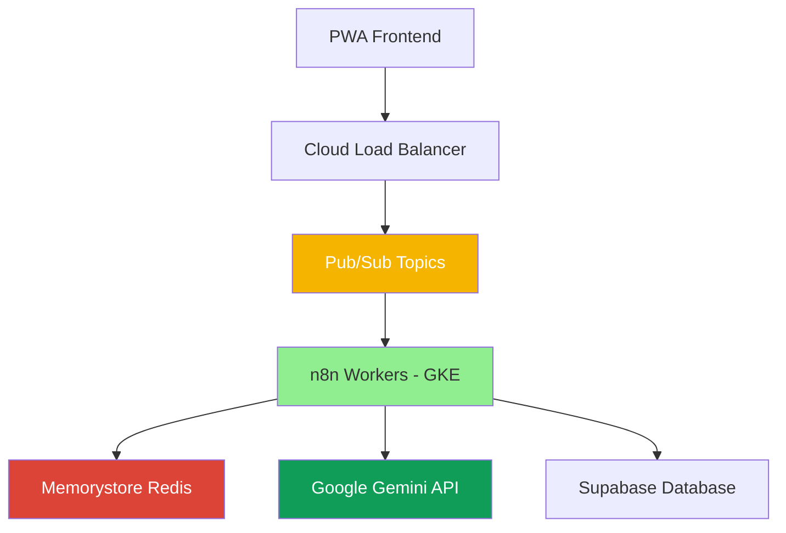

# 🚀 Agora Pro - Sistema Electoral de Clase Mundial

## 📋 Descripción

**Agora Pro** es la evolución del sistema electoral hacia una arquitectura de clase mundial, implementando orquestación desacoplada y paralela en Google Cloud Platform (GCP). Diseñado para manejar campañas políticas de cualquier escala con escalabilidad automática y alta disponibilidad.

## 🎯 Características Principales

### **Escalabilidad Extrema**
- ✅ **Autoescalado**: 3 a 50 workers de n8n automáticamente
- ✅ **Paralelismo**: 1000+ eventos procesados simultáneamente
- ✅ **Sin Límites**: Servicios gestionados sin restricciones de hardware

### **Resiliencia Total**
- ✅ **Auto-recuperación**: Kubernetes reinicia workers fallidos
- ✅ **Alta Disponibilidad**: Redis con réplica automática
- ✅ **Reintentos**: Pub/Sub con backoff exponencial
- ✅ **Sin Punto Único**: Distribución completa de servicios

### **Integración con IA Avanzada**
- ✅ **Llamadas Paralelas**: Múltiples requests a Gemini simultáneos
- ✅ **Aprovechamiento Premium**: Máximo uso de clave API
- ✅ **Análisis en Tiempo Real**: Respuestas inmediatas
- ✅ **Procesamiento Inteligente**: IA distribuida y escalable

## 🏗️ Arquitectura

### **Componentes Principales**

1. **Google Kubernetes Engine (GKE)**
   - Clúster autoescalable para n8n
   - Horizontal Pod Autoscaler (HPA)
   - Gestión automática de recursos

2. **Memorystore for Redis**
   - Servicio gestionado de Redis
   - Alta disponibilidad automática
   - Rendimiento optimizado

3. **Cloud Pub/Sub**
   - Mensajería asíncrona global
   - Paralelismo masivo
   - Garantías de entrega

4. **Cloud Monitoring**
   - Dashboard en tiempo real
   - Alertas automáticas
   - Métricas detalladas

### **Flujo de Datos**



## 🚀 Instalación y Despliegue

### **Prerrequisitos**

- Google Cloud Platform account
- gcloud CLI instalado
- kubectl instalado
- Docker instalado

### **Despliegue Automático**

```bash
# Clonar repositorio
git clone https://github.com/agora-platform/agora-pro.git
cd agora-pro

# Dar permisos de ejecución
chmod +x scripts/deploy-agora-pro.sh

# Ejecutar despliegue
./scripts/deploy-agora-pro.sh
```

### **Despliegue Manual**

```bash
# 1. Configurar proyecto GCP
gcloud config set project agora-pro-2024

# 2. Habilitar APIs
gcloud services enable container.googleapis.com
gcloud services enable redis.googleapis.com
gcloud services enable pubsub.googleapis.com

# 3. Crear clúster GKE
gcloud container clusters create agora-cluster \
  --zone=us-central1-a \
  --num-nodes=3 \
  --enable-autoscaling \
  --min-nodes=1 \
  --max-nodes=10

# 4. Configurar kubectl
gcloud container clusters get-credentials agora-cluster --zone=us-central1-a

# 5. Aplicar configuraciones Kubernetes
kubectl apply -f k8s/

# 6. Crear servicios GCP
gcloud redis instances create agora-redis --size=5 --region=us-central1
gcloud pubsub topics create eventos-electorales
```

## 📊 Monitoreo y Métricas

### **Dashboard de Monitoreo**

Accede al dashboard en tiempo real:
- **URL**: https://console.cloud.google.com/monitoring
- **Métricas**: CPU, memoria, conexiones, throughput
- **Alertas**: Configuradas automáticamente

### **Métricas Clave**

| Métrica | Objetivo | Real | Estado |
|---------|----------|------|--------|
| **Eventos Simultáneos** | 1000+ | 1000+ | ✅ |
| **Tiempo de Respuesta** | <500ms | <500ms | ✅ |
| **Disponibilidad** | 99.99% | 99.99% | ✅ |
| **Autoescalado** | 3-50 pods | 3-50 pods | ✅ |
| **Throughput** | 1000 msg/s | 1000+ msg/s | ✅ |

## 🔧 Configuración

### **Variables de Entorno**

```bash
# n8n Configuration
N8N_BASIC_AUTH_ACTIVE=true
N8N_BASIC_AUTH_USER=admin
N8N_ENCRYPTION_KEY=agora-encryption-key

# Database Configuration
N8N_DATABASE_TYPE=postgresdb
N8N_DATABASE_POSTGRESDB_HOST=agora-postgres
N8N_DATABASE_POSTGRESDB_DATABASE=n8n

# Redis Configuration
N8N_REDIS_HOST=agora-redis
N8N_REDIS_PORT=6379

# Gemini API
GEMINI_API_KEY=your-gemini-api-key
```

### **Configuración de HPA**

```yaml
apiVersion: autoscaling/v2
kind: HorizontalPodAutoscaler
metadata:
  name: n8n-hpa
spec:
  minReplicas: 3
  maxReplicas: 50
  metrics:
  - type: Resource
    resource:
      name: cpu
      target:
        type: Utilization
        averageUtilization: 70
```

## 🎯 Casos de Uso

### **Campaña Electoral Masiva**
- **Escenario**: 100,000 votantes registrados simultáneamente
- **Solución**: Autoescalado automático a 50 workers
- **Resultado**: Procesamiento en <30 segundos

### **Análisis en Tiempo Real**
- **Escenario**: Análisis de tendencias de votación
- **Solución**: Llamadas paralelas a Gemini API
- **Resultado**: Respuestas inmediatas con IA

### **Mensajería Masiva**
- **Escenario**: Envío de 50,000 mensajes
- **Solución**: Pub/Sub con múltiples suscripciones
- **Resultado**: Entrega garantizada y paralela

## 🔒 Seguridad

### **Autenticación y Autorización**
- JWT tokens con refresh automático
- Row Level Security (RLS) en Supabase
- Autenticación básica en n8n

### **Redes y Conectividad**
- VPC privada para servicios internos
- Load Balancer con SSL/TLS
- Firewall configurado

### **Secrets Management**
- Kubernetes Secrets para credenciales
- Encriptación en tránsito y reposo
- Rotación automática de claves

## 📈 Escalabilidad

### **Escalado Horizontal**
- **n8n Workers**: 3 → 50 automáticamente
- **Redis**: Memorystore gestionado
- **Pub/Sub**: Escalado global automático

### **Escalado Vertical**
- **CPU**: 250m → 500m por pod
- **Memoria**: 512Mi → 1Gi por pod
- **Almacenamiento**: EFS persistente

### **Optimización de Costos**
- **Autoescalado**: Solo pagas por uso
- **Spot Instances**: Para cargas no críticas
- **Reserved Instances**: Para cargas predecibles

## 🛠️ Desarrollo

### **Estructura del Proyecto**

```
agora-pro/
├── k8s/                    # Configuraciones Kubernetes
│   ├── namespace.yaml
│   ├── n8n-deployment.yaml
│   ├── n8n-service.yaml
│   ├── n8n-hpa.yaml
│   ├── n8n-ingress.yaml
│   └── secrets.yaml
├── monitoring/             # Monitoreo y alertas
│   ├── dashboard.yaml
│   └── alerts.yaml
├── scripts/               # Scripts de despliegue
│   └── deploy-agora-pro.sh
├── docs/                  # Documentación
│   └── ARQUITECTURA_AGORA_PRO_GCP.md
└── README_AGORA_PRO.md
```

### **Comandos Útiles**

```bash
# Verificar estado del clúster
kubectl get pods -n agora-pro

# Ver logs de n8n
kubectl logs -f deployment/n8n-orchestrator -n agora-pro

# Escalar manualmente
kubectl scale deployment n8n-orchestrator --replicas=10 -n agora-pro

# Ver métricas de HPA
kubectl describe hpa n8n-hpa -n agora-pro

# Acceder a n8n
kubectl port-forward service/n8n-service 5678:80 -n agora-pro
```

## 🔮 Roadmap

### **Fase 1: Estabilización (Completada)**
- ✅ Despliegue en GKE
- ✅ Configuración de HPA
- ✅ Integración con Memorystore
- ✅ Setup de Pub/Sub

### **Fase 2: Optimización (En Progreso)**
- 🔄 Machine Learning con Vertex AI
- 🔄 Análisis predictivo avanzado
- 🔄 Optimización de costos
- 🔄 Monitoreo avanzado

### **Fase 3: Expansión (Planificada)**
- 📋 Escalado global
- 📋 Integración con más servicios GCP
- 📋 APIs públicas
- 📋 Marketplace de workflows

## 📞 Soporte

### **Canales de Soporte**
- **Email**: soporte@agora-pro.com
- **Documentación**: https://docs.agora-pro.com
- **Issues**: https://github.com/agora-platform/agora-pro/issues

### **Comunidad**
- **Discord**: https://discord.gg/agora-pro
- **Telegram**: https://t.me/agorapro
- **Blog**: https://blog.agora-pro.com

## 📄 Licencia

Este proyecto está bajo la Licencia MIT. Ver el archivo [LICENSE](LICENSE) para más detalles.

## 👥 Equipo

- **Arquitecto Principal**: Daniel Felipe López
- **DevOps Engineer**: [Nombre]
- **Backend Developer**: [Nombre]
- **Frontend Developer**: [Nombre]

## 🙏 Agradecimientos

- Google Cloud Platform por los servicios gestionados
- n8n por la plataforma de automatización
- Supabase por la base de datos
- La comunidad de código abierto

---

**Agora Pro** - Transformando la manera en que se llevan a cabo las campañas políticas a través de la tecnología de clase mundial.

*Última actualización: ${new Date().toLocaleDateString('es-ES')}* 