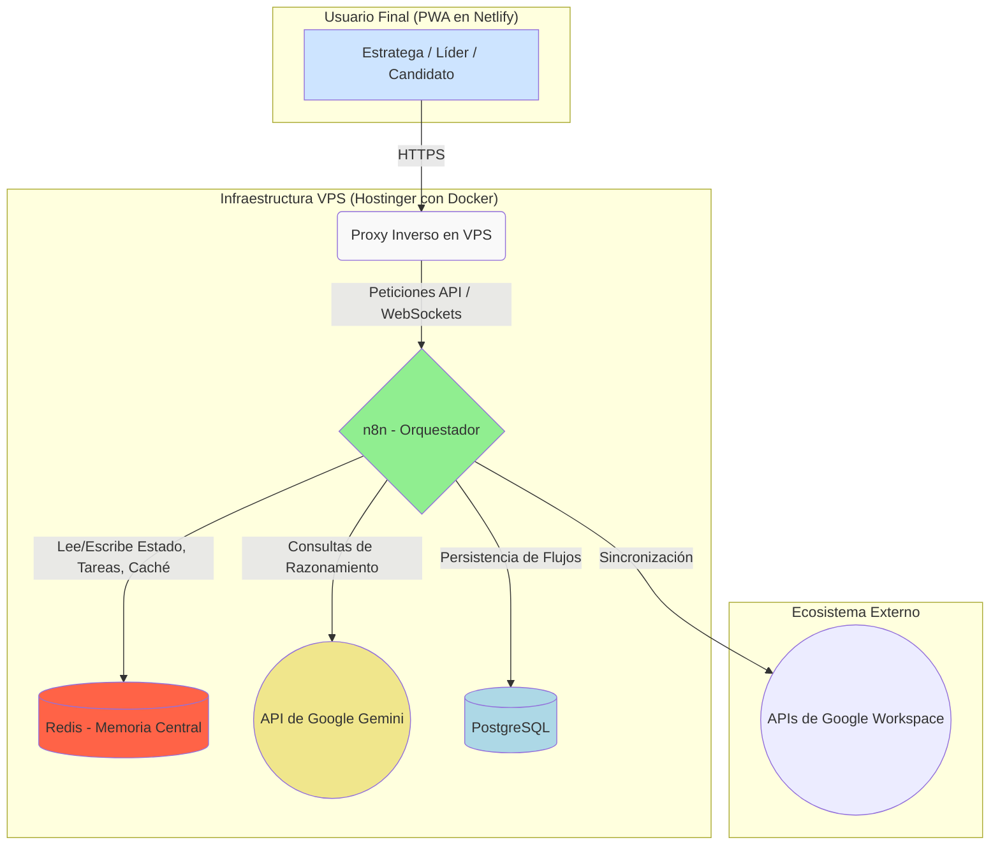
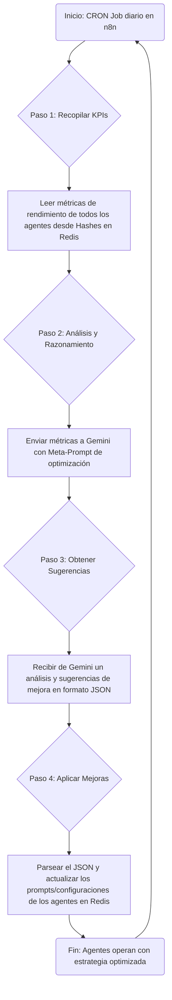

# Capítulo 3: Diseño y Arquitectura del Sistema "Agora"

## 3.1 Mapa Sinóptico de la Arquitectura General



**Descripción:**
Este mapa sinóptico ilustra la arquitectura de alto nivel. El usuario interactúa con la PWA, cuyas peticiones son dirigidas por un proxy al contenedor de n8n. n8n actúa como el cerebro de operaciones, utilizando Redis como su memoria de trabajo, PostgreSQL para su propia persistencia, y llamando a APIs externas como Gemini y Google Workspace para inteligencia y sincronización.

---

## 3.2 Flujograma del Proceso de Autenticación y Enrutamiento Basado en Roles

```mermaid
flowchart TD
    Start[Usuario ingresa credenciales en la PWA] --> A{PWA envía POST a /auth/login};
    A --> B[Flujo n8n 'Auth' se activa];
    B --> C{Verificar credenciales contra BBDD};
    C -- Exitoso --> D[Consultar Rol del Usuario];
    C -- Fallido --> E[Devolver Error 401];
    D --> F[Generar JSON Web Token (JWT) con Rol];
    F --> G[Devolver JWT a la PWA];
    G --> H{PWA guarda JWT y lee el Rol};
    H --> I{Switch (Rol)};
    I -- Rol: Líder --> J[Redirigir a /dashboard/lider];
    I -- Rol: Candidato --> K[Redirigir a /dashboard/candidato];
    I -- Rol: Estratega --> L[Redirigir a /dashboard/estrategia];
    E --> End[Mostrar mensaje de error en PWA];
    J & K & L --> EndOK[Usuario ve su dashboard personalizado];
```

**Descripción:**
Este flujograma detalla el proceso seguro de inicio de sesión. Muestra cómo n8n centraliza la lógica de autenticación y cómo la PWA utiliza el rol contenido en el JWT para dirigir al usuario a la interfaz correcta, garantizando una experiencia personalizada y segura.

---

## 3.5 Flujograma del Bucle de Auto-Mejora de Agora



**Descripción:**
Este es el corazón del sistema adaptativo. El flujograma visualiza el proceso autónomo mediante el cual Agora evalúa el rendimiento, utiliza la IA para razonar sobre posibles mejoras, y modifica dinámicamente el comportamiento de sus agentes subordinados para mejorar la eficacia de la campaña. 